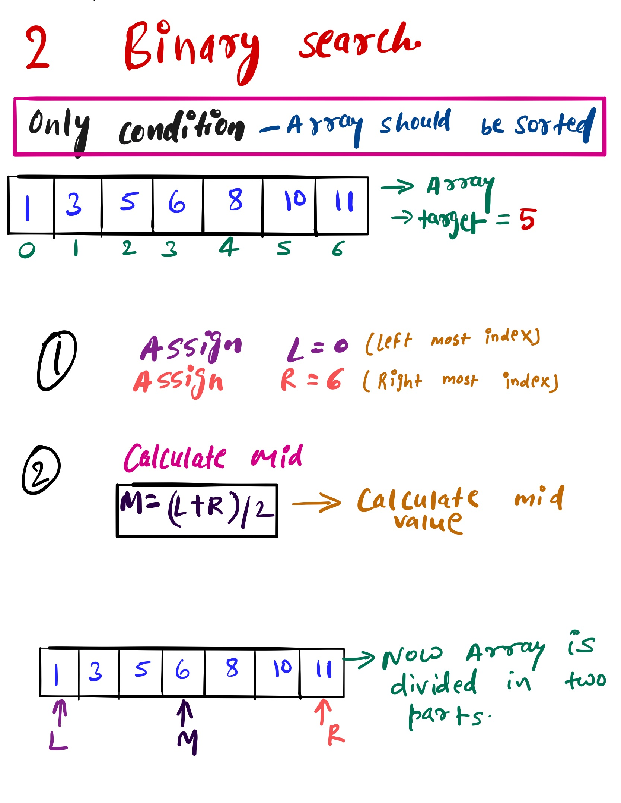
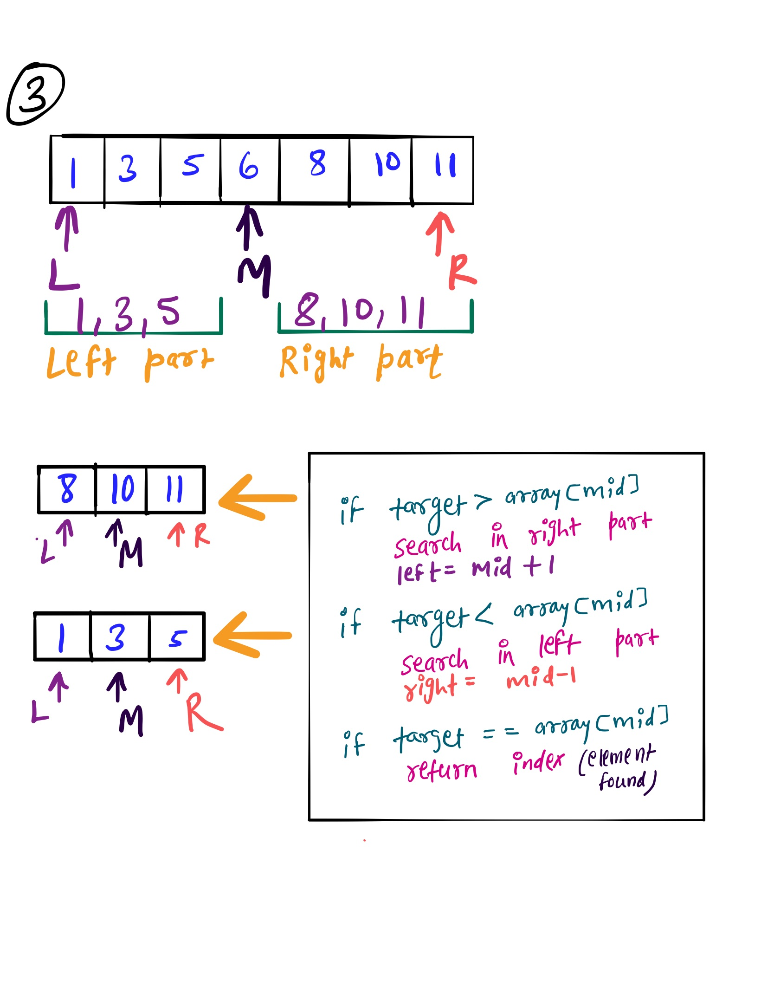
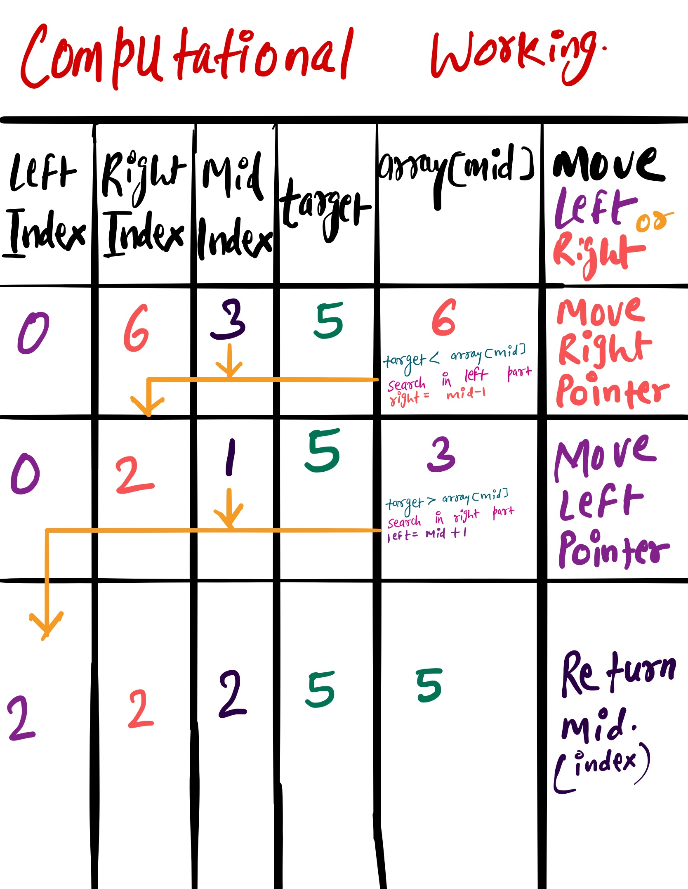

# Binary Search #
Binary Search
Write a function that takes in a sorted array of integers as well as a target integer. The function should use the Binary Search algorithm to determine if
the target integer is contained in the array and should return its index if it is, otherwise -1 .
If you're unfamiliar with Binary Search, please watch the Conceptual Overview [Link to the Video](https://www.youtube.com/watch?v=T98PIp4omUA) 
### Sample Input ###
array = [0, 1, 21, 33, 45, 45, 61, 71, 72, 73]
target = 33
### Sample Output ###
3

### Important Condition ###
To perfrom binary search the array has to be sorted. 

### Hint ###
Divide and conquer   

# Example #

