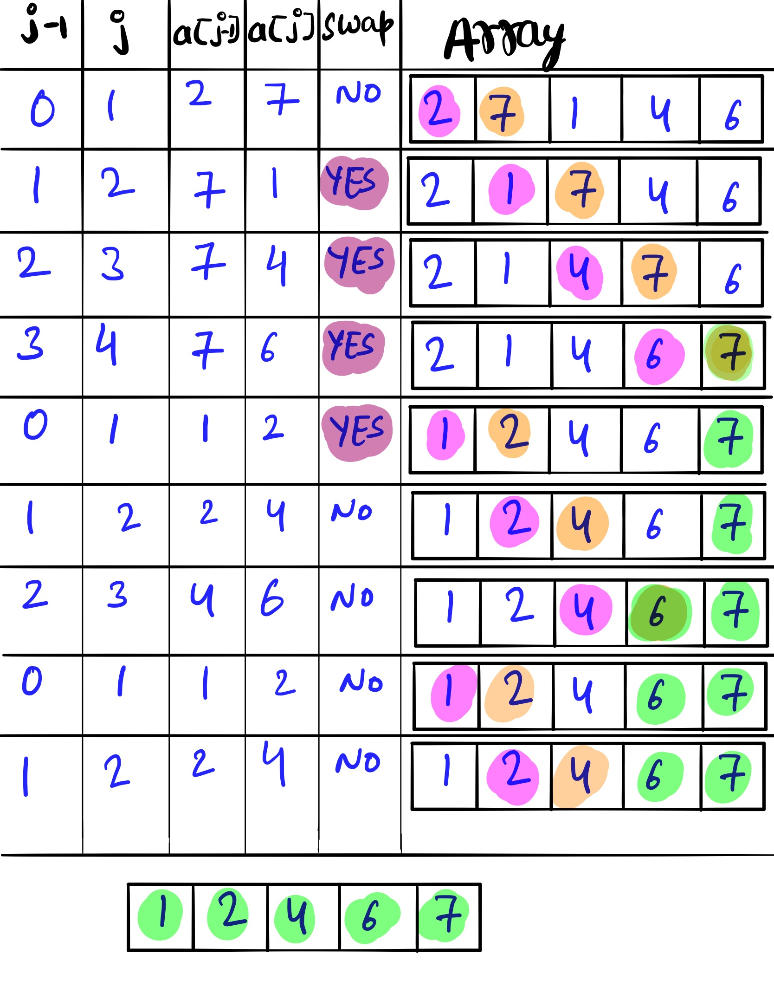

# Bubble Sort #
Write a function that takes in an array of integers and returns a sorted version of that array. Use the Bubble Sort algorithm to sort the array.
If you're unfamiliar with Bubble Sort,watch this video which will give the conceptual overview of the Bubble sort [Link to the Video](https://www.youtube.com/watch?v=lyZQPjUT5B4) 
### Sample Input ###
array = [8, 5, 2, 9, 5, 6, 3]
### Sample Output ###
[2, 3, 5, 5, 6, 8, 9]

### Idea: ###
Do len(array):
	Compare element(j) with next element (j+1) 
	if array[j] is greater than array[j+1]:
		swap array[j] witharray[j+1]  

# Example #

