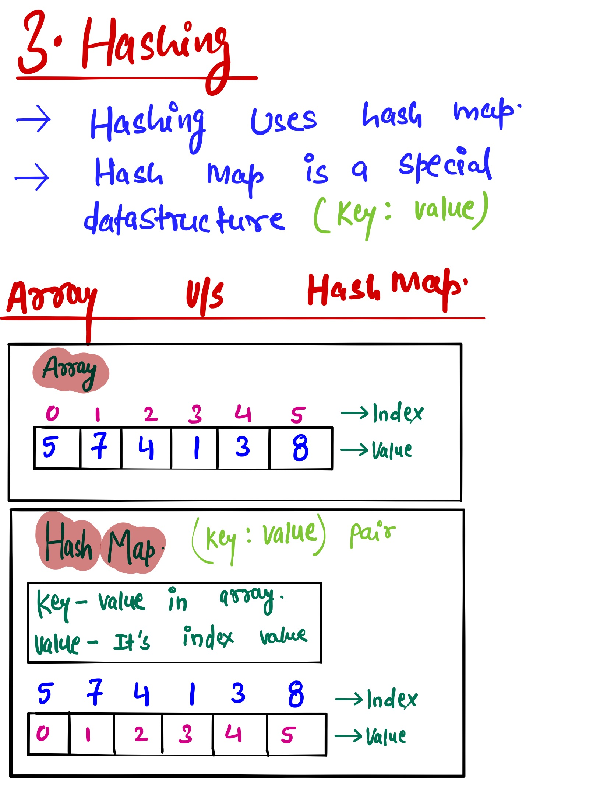
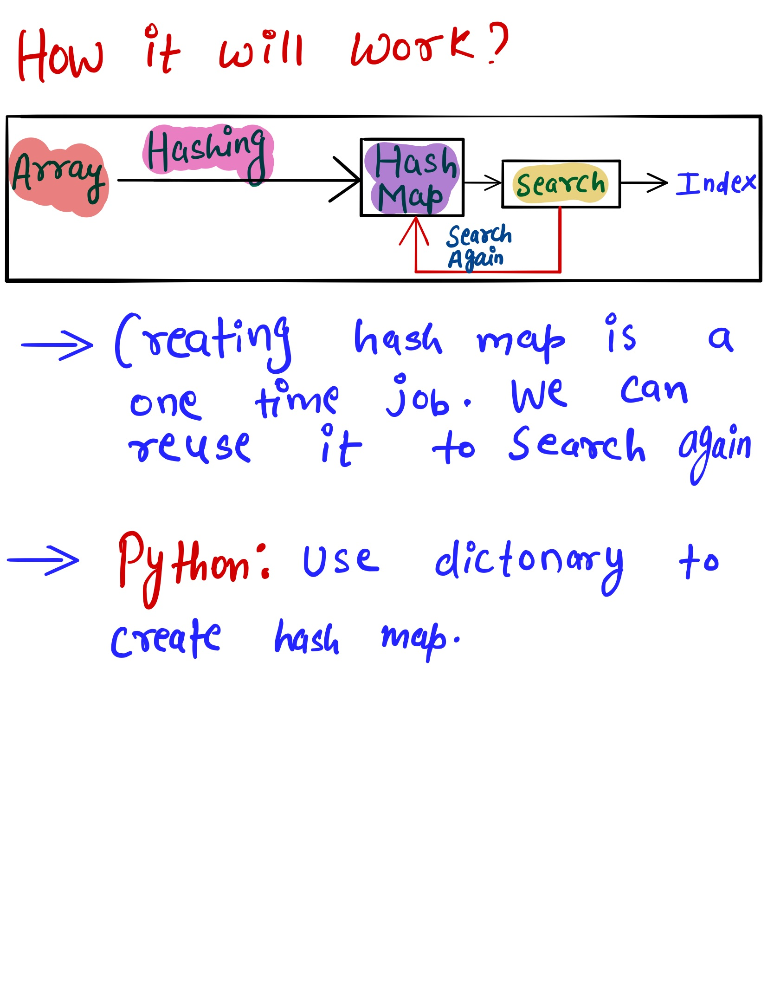

# Hashing #
Write a function that takes in a array of integers. The function should create a hashed output.
The function should return dictonary data structure which is in the from of key value pair where key is array element and its value is number of times element occurred in the array. 
If you're unfamiliar with Hashing, please watch the Conceptual Overview [Link to the Video](https://www.youtube.com/watch?v=wWgIAphfn2U&feature=emb_logo) 

### Sample Input ###
array = [1,4,5,4,1,3,6,7,1,7,10,9]
### Sample Output ###
{1: 3, 4: 2, 5: 1, 3: 1, 6: 1, 7: 2, 10: 1, 9: 1}
 

# Example #

