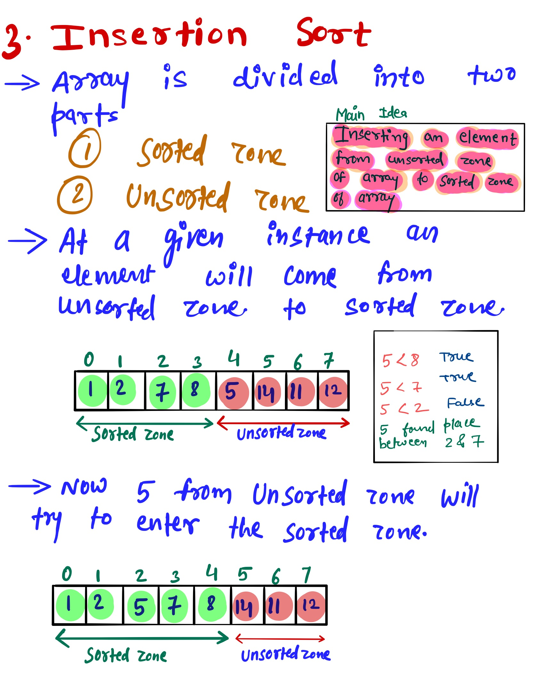
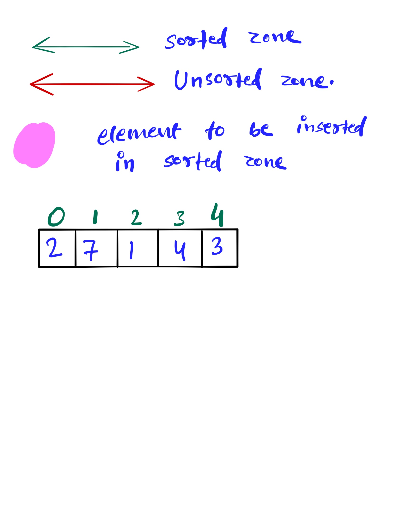
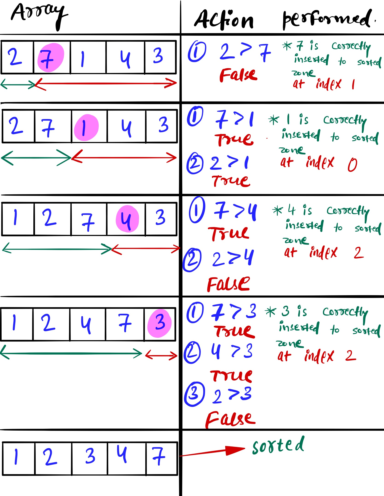

# Insertion Sort #
Write a function that takes in an array of integers and returns a sorted version of that array. Use the Insertion Sort algorithm to sort the array.
If you're unfamiliar with Insertion sort watch this video which will give the conceptual overview of the Insertion sort [Link to the Video](https://www.linkedin.com/posts/mayank-dubey11_datastructures-algorithms-sorting-activity-6759822630087360512-NQ2F)

### Sample Input ###
array = [8, 5, 2, 9, 5, 6, 3]
### Sample Output ###
[2, 3, 5, 5, 6, 8, 9]

### Idea ###
The main idea comes from the name inserting a new element from unsorted zone to sorted zone of an array.

### Time complexity ###
Best case - O(N)  
Average case - O(N^2)  
Worst case - O(N^2)  

### Space complexity ###
O(1)

### Solution ###
InsertionSort.py

# Example #

