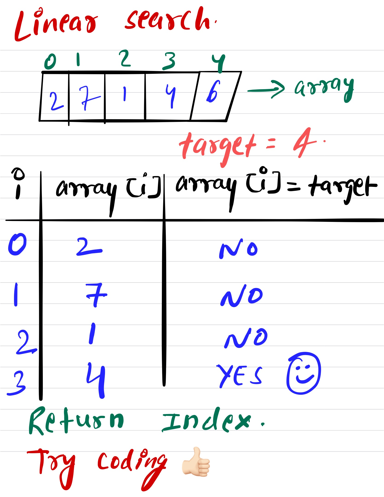

# Linear Search #
Write a function that takes in an array of integers and elment we want to search in the array. It should return the index number if element is found in the array else it should return False.
If you're unfamiliar with Linear search, watch this video which will give the conceptual overview of the Linear search [Link to the Video] (https://www.linkedin.com/posts/mayank-dubey11_datastructures-algorithm-linearsearch-activity-6752881789292818432--25H)
### Sample Input ###
array = [5,6,3,8,9,10,1]
element = 1
### Sample Output ###
6
# Example #

