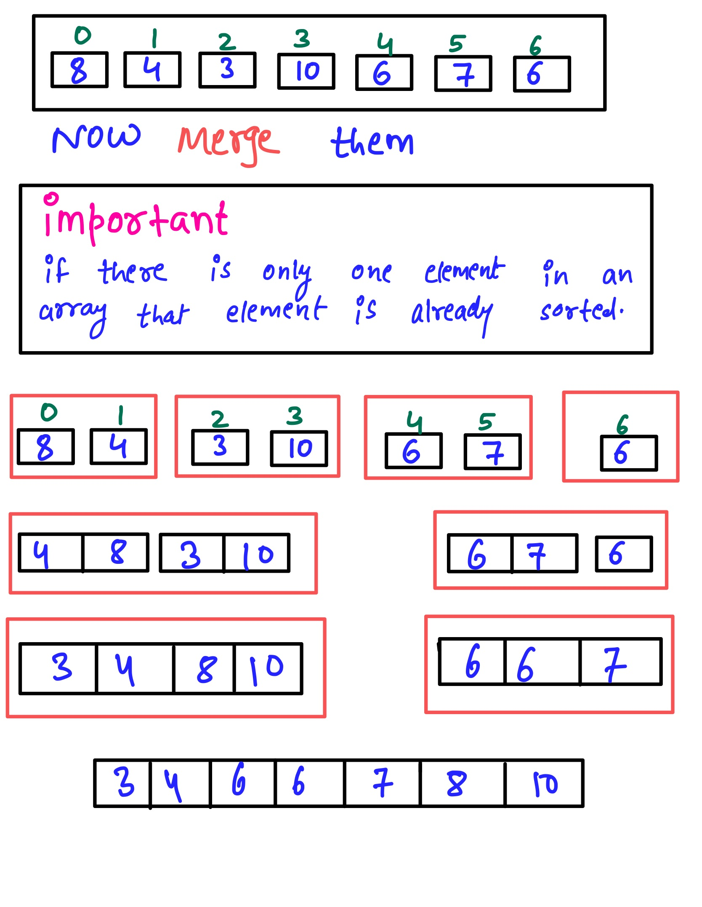

# Merge Sort #
Write a function that takes in an array of integers and returns a sorted version of that array. Use the Merge Sort algorithm to sort the array.
If you're unfamiliar with Merge Sort,watch this video which will give the conceptual overview of the Quick sort [Link to the Video](https://www.linkedin.com/posts/mayank-dubey11_merge-sort-spend-time-with-code-its-not-activity-6760919926350909440-OzOm) 
### Sample Input ###
array = [8, 5, 2, 9, 5, 6, 3]
### Sample Output ###
[2, 3, 5, 5, 6, 8, 9]

### Idea: ###
<li> Initialize L (Left most index in array), R (Right most index in array) </li>
<li> Calculate Mid = floor((L+R)/2) </li>
<li> Now divide array into two parts, that two parts are: arr[l:mid] and arr[mid+1,r]</li>
<li>Recursively divide Left side  and Right side of array</li>

### Time complexity ###
Best case - O(N log N)
Average case - O(N log N)
Worst case - O(N log N)

#Space Complexity ###
O(N)

# Example #

