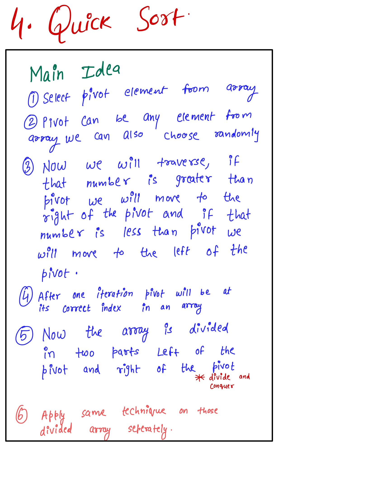
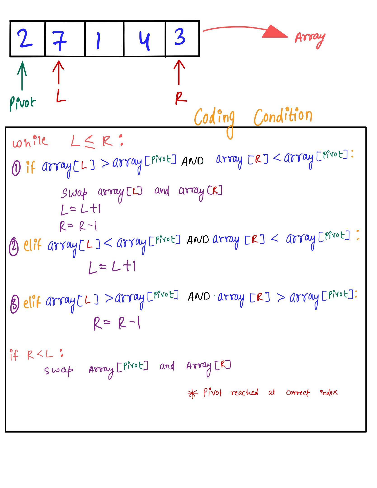
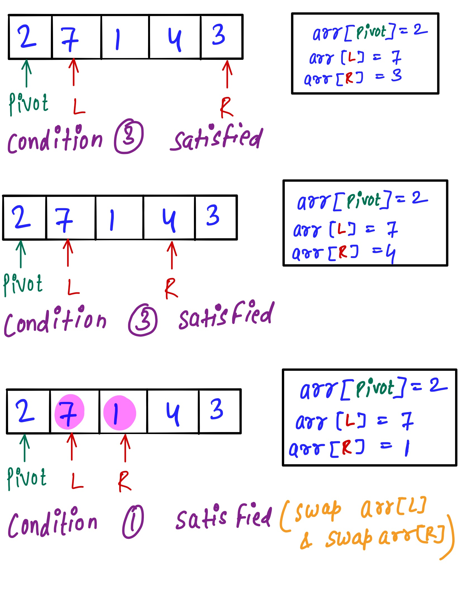
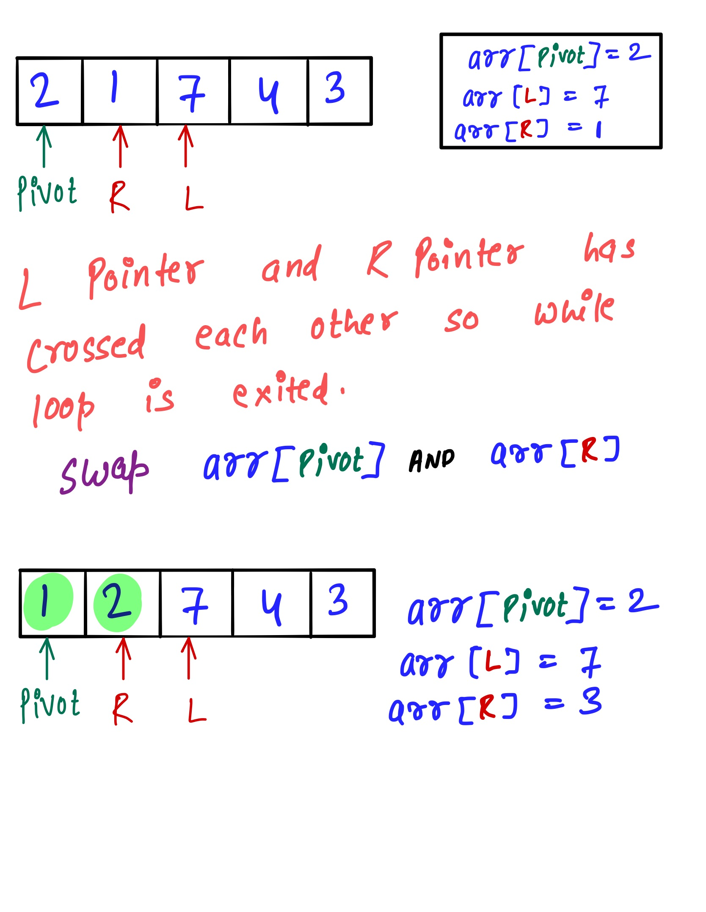
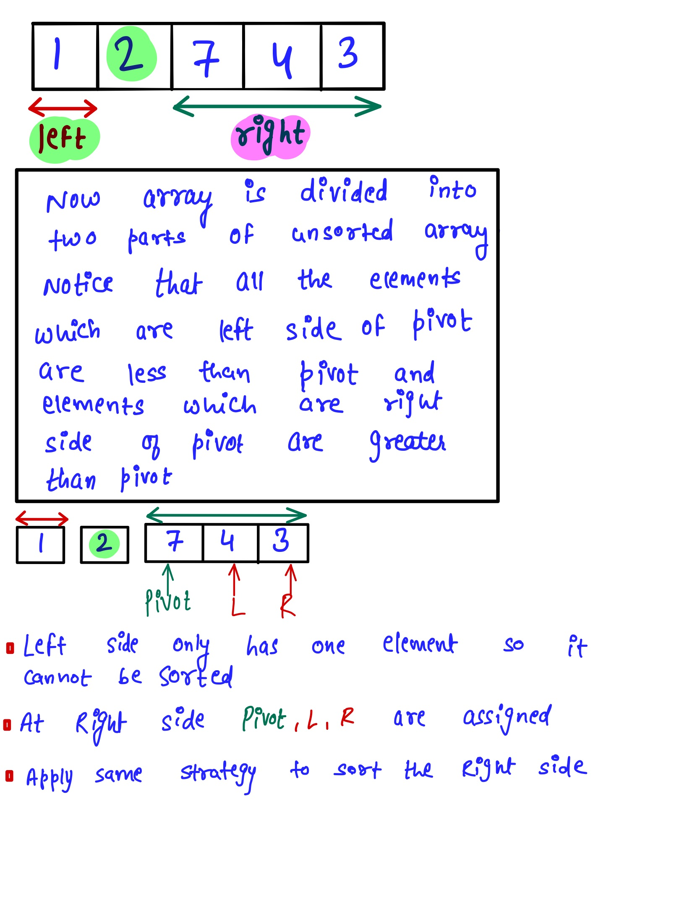

# Quick Sort #
Write a function that takes in an array of integers and returns a sorted version of that array. Use the Quick Sort algorithm to sort the array.
If you're unfamiliar with Quick Sort,watch this video which will give the conceptual overview of the Quick sort [Link to the Video](https://www.youtube.com/watch?v=lyZQPjUT5B4) 
### Sample Input ###
array = [8, 5, 2, 9, 5, 6, 3]
### Sample Output ###
[2, 3, 5, 5, 6, 8, 9]

### Idea: ###
<li>The idea is to select random element (pivot element) and after every iteration the pivot will be placed at it's correct index.</li>
<li>Now array is divided in two parts left of pivot and right of pivot (divide and conquer).</li>
<li>Apply same procedure on those two parts.</li>

# Example #

