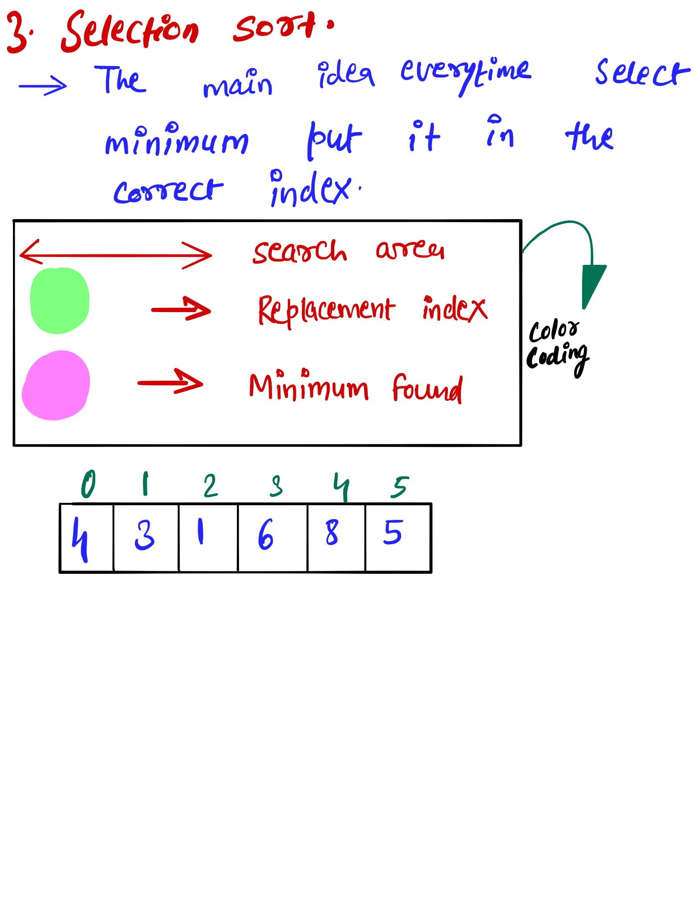
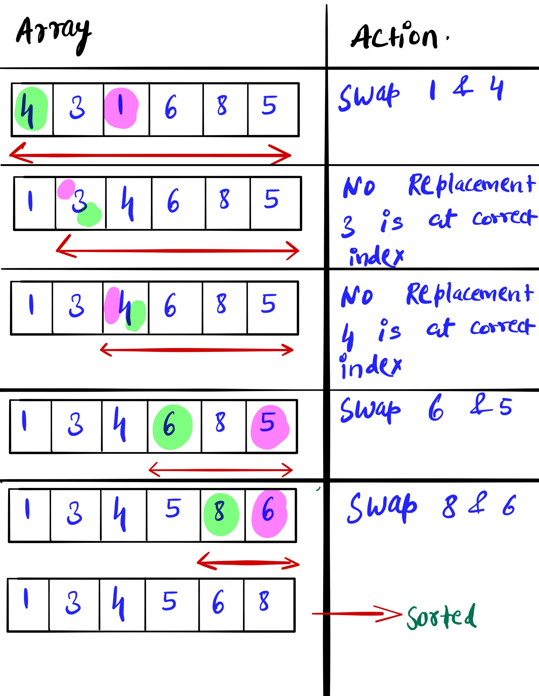

# Selection Sort #
Write a function that takes in an array of integers and returns a sorted version of that array. Use the Selection Sort algorithm to sort the array.
If you're unfamiliar with Selection Sort,watch this video which will give the conceptual overview of the Insertion sort [Link to the Video](https://www.youtube.com/watch?v=Ns4TPTC8whw) 
### Sample Input ###
array = [8, 5, 2, 9, 5, 6, 3]
### Sample Output ###
[2, 3, 5, 5, 6, 8, 9]

### Idea ##
Idea is to get maximum or minimum element in each iteration and placing it to its appropriate index

### Solution 1 ###
solution2.py - getting minimum element and placing it to the approriate postion.

# Example #

